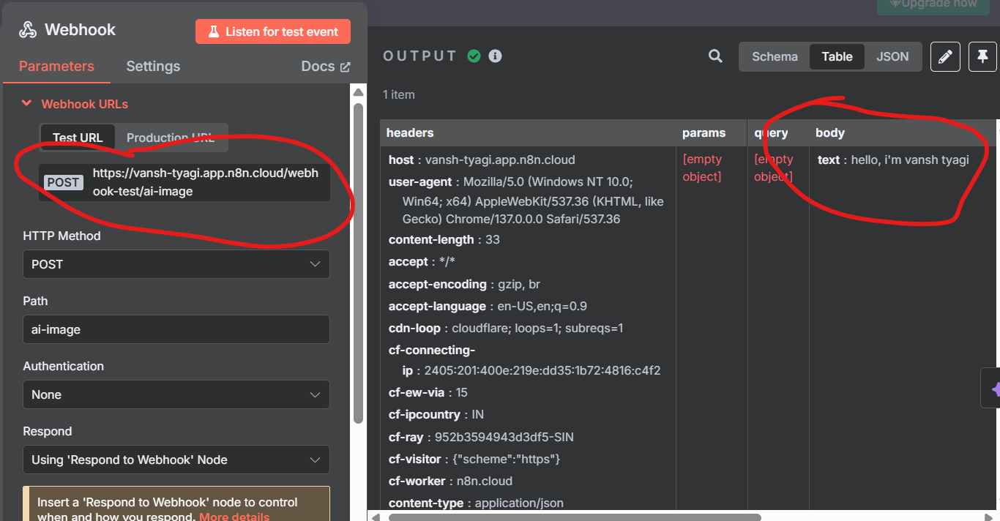

#  Your first Chat App with  webhook  

Welcome to your first real automation project using **n8n**!  
This repo teaches you how to **connect a frontend chat app to a webhook** in n8n — perfect for beginners in JavaScript and HTML.

---

  

  <a href="https://github.com/Vansh-Tyagi-git/n8n-starter-chatbot/blob/main/1st%20code%20Documentation%20.pdf" target="_blank">
    📄 <strong>Get started with Documentation (PDF)</strong>
  </a>

  

---  

## 📦 What You'll Learn

✅ How to set up a webhook in n8n  
✅ How to send a message from HTML to n8n  
✅ How to display bot responses in a styled chat UI  
✅ How to clean and secure responses (HTML escaping, markdown cleanup)

---

## 💻 Run Locally

> 🛠️ See the browser console — you'll find how data looks at the backend via raw JSON.

---

## 🔧 Prerequisites

- Basic knowledge of HTML and JavaScript
- n8n cloud account (or local setup)
- A modern browser

---

## 🌐 Live Demo

---

## 🚀 How It Works

### 1. Setup n8n Webhook
Create a webhook in n8n with the path `/webhook-test/ai-image`.  
Use "Respond to Webhook" node to send back responses.

### 2. Frontend (HTML + JS)
This project uses vanilla JS to:
- Capture user input
- Send it to n8n webhook using `fetch()`
- Display bot response in the chat window

### 3. Clean Server Response
We clean and display the bot's reply using:
- `.replace()` to remove `<think>` tags and markdown
- Basic HTML escaping for security

